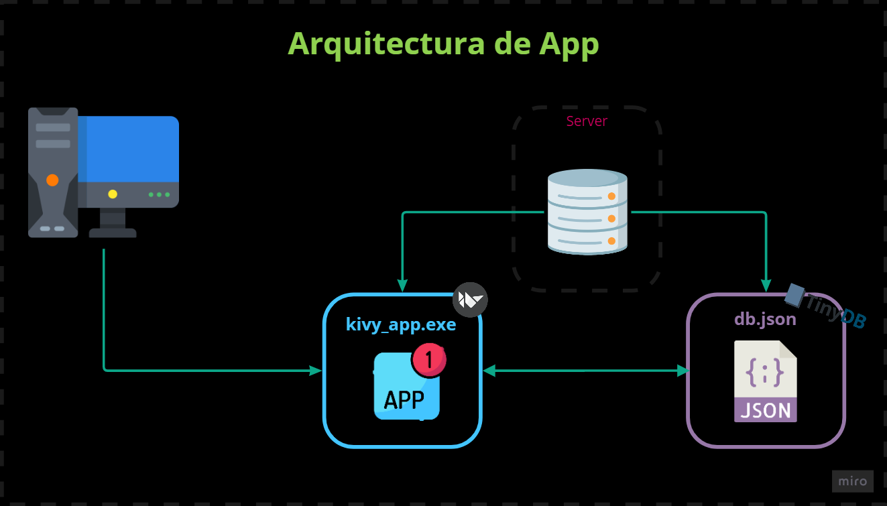

# Document Control Manager ("Gerente de Control de Documentos")
---
## Objetivo

Control y seguimiento de documentos en una Obra en Construccion

## Alcance

La plataforma comprende las responsabilidades de los siguientes sectores:
- Control de documentacion
- Calidad
- Oficina Tecnica
- Produccion
- Otros

## Descripcion del proyecto

El proyecto se inicio como solucion a la alternativa escritorio, para poder ser utilizada dentro de la red privada o VPN del Unidad de Gestion del proyecto.
La aplicacion corre en un marco de windows como executable, obteniendo datos de una base de datos local en la red.

*La aplicacion se divide en dos paneles de control*:
- Panel de Carga
- Panel de Consulta

## Funcionalidades y caracteristicas

Al divirse en dos paneles de control, cada uno tiene sus propias funcionalidades y caracteristicas. A continuacion se hace un detalle de cada una:

### Panel de Carga

Este panel es propio de control de documentos, para el uso interno de las siguientes funciones:

1. Carga de Documento Nuevo
2. Actualizacion de Documento
3. Actualizacion de Revision Nueva
4. Carga de Revision Interna
5. Actualizacion de Revision Interna
6. Anulacion de Documentos

### Panel de Consulta

Este panel tiene acceso cualquier personal de la red, donde se realizan las siguientes funciones:

1. Consulta de documento
2. Detalle de Documento
3. Exportacion a una tabla de datos
4. Solicitud de Copia Controlada

## Arquitectura de la aplicacion

La arquitectura de la aplicacion se estructura de la siguiente forma:

Por un lado tenemos los clientes, que ejecutan la *kivy_app.exe* que se almacena en el Server Local, donde tambien se aloja una base de datos en formato **JSON**, que consume la kivy_app. Tanto sea para el panel de carga como el de consulta.

### Dependencias

- KivyMD == 0.104.2
- Kivy >= 2.0.0 (Installation)
- TinyDB == 4.7.0
- Python +3.8 

## Desarrollo y Etapas

Para el desarrollo de la plataforma, se utilizara la metodologia agil, y asi obtener un producto terminado bajo posibles mejoras y caracteristicas que se puedan agregar en el proceso de la construccion.

Se procede a realizar dos milestone:
- Panel de Carga
- Panel de Consulta

Realizando un sprint en cada uno de los milestone, con una duracion de una semana. El siguimiento se realizara a traves de Github Projects.

Las etapas para cada uno de los paneles son los siguientes:

1. Estructura de datos
2. Blueprint Service
3. Wireframing
4. Modelado en kv language
5. Despliegue

## Roadmap

Disponible en los milestone de Github