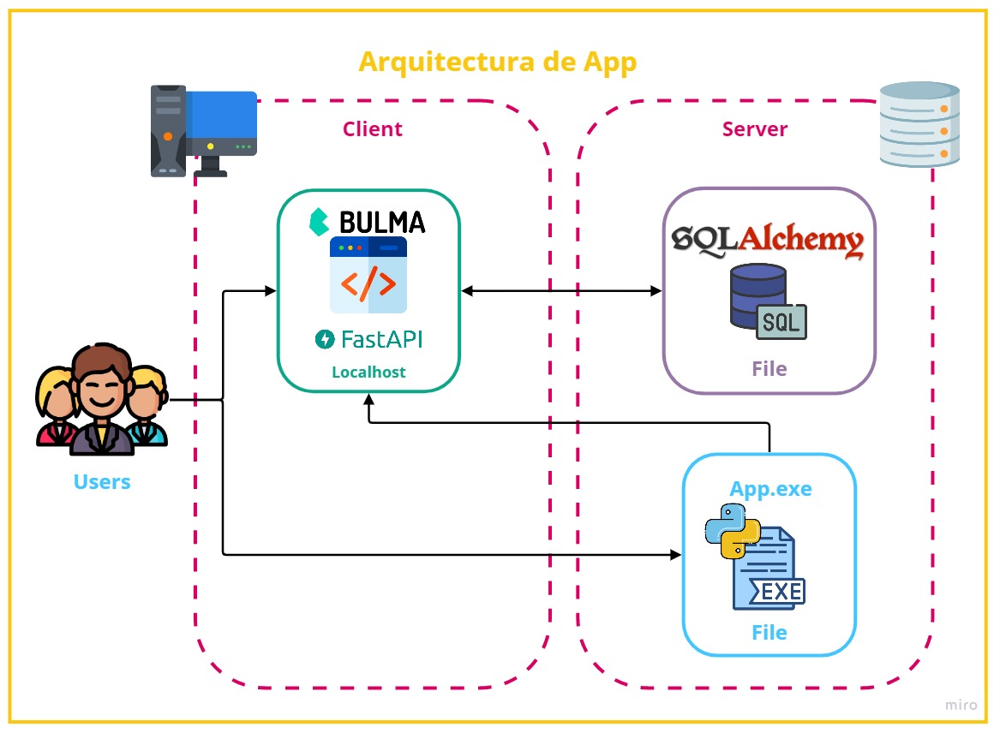
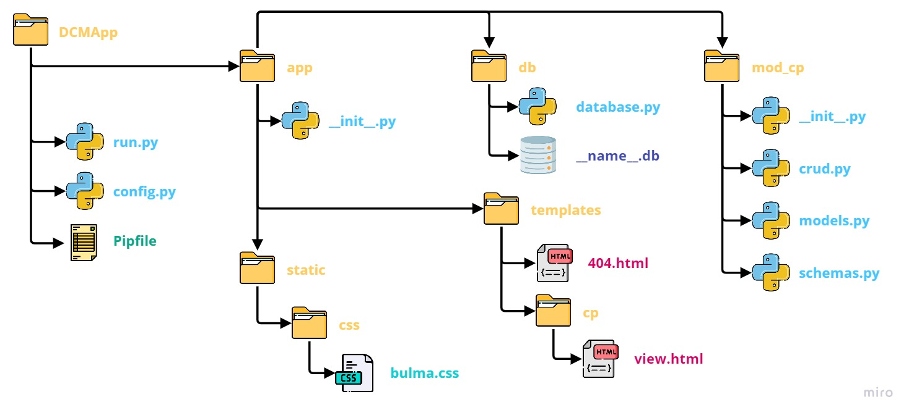

# Document Control Manager ("Gerente de Control de Documentos")
---
## Objetivo

Control y seguimiento de documentos en una Obra en Construccion

## Alcance

La plataforma comprende las responsabilidades de los siguientes sectores:
- Control de documentacion
- Calidad
- Oficina Tecnica
- Produccion
- Otros

## Descripcion del proyecto

El proyecto se inicio como solucion a la alternativa escritorio, para poder ser utilizada dentro de la red privada o VPN del Unidad de Gestion del proyecto.
La aplicacion corre en un marco de windows como executable, obteniendo datos de una base de datos local en la red.

*La aplicacion se divide en dos paneles de control*:
- Panel de Carga
- Panel de Consulta

## Funcionalidades y caracteristicas

Al divirse en dos paneles de control, cada uno tiene sus propias funcionalidades y caracteristicas. A continuacion se hace un detalle de cada una:

### Panel de Carga

Este panel es propio de control de documentos, para el uso interno de las siguientes funciones:

1. Carga de Documento Nuevo
2. Actualizacion de Documento
3. Actualizacion de Revision Nueva
4. Carga de Revision Interna
5. Actualizacion de Revision Interna
6. Anulacion de Documentos

### Panel de Consulta

Este panel tiene acceso cualquier personal de la red, donde se realizan las siguientes funciones:

1. Consulta de documento
2. Detalle de Documento
3. Exportacion a una tabla de datos
4. Solicitud de Copia Controlada

## Arquitectura de la aplicacion

La arquitectura de la aplicacion se estructura de la siguiente forma:

La aplicacion se ejecuta desde el servidor, levantando un servidor web local.
Interactuando con la base de datos en SQLAlchemy.

### Dependencias

- Flask
- Bulma
- Flask-SQLAlchemy
- Python +3.8 

### Estructura del proyecto

## Despliegue de la aplicacion

# Pipenv

Se construye el entorno a traves de la libreria pipenv, para poder instalarla se utiliza el siguiente comando:

`
pip install pipenv
`

Una vez configurado pipenv, se procede a instalar las Dependencias del proyecto.
`
pipenv install
`

La configuración de flask se puede editar en el archivo 'Pipfile', y iniciar el servidor de la siguiente manera:

`
pipenv run flask run
`